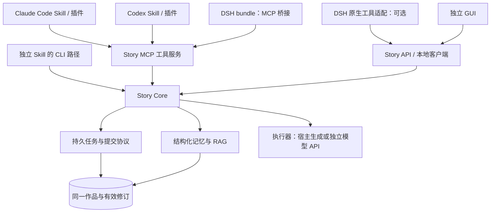

# Hulk Story Agent：Claude Code、Codex 与 DeepSeek Harness 接入

版本：补充设计 v0.2 · 2026-09-10。共享 Skill、MCP 配置和 DSH bridge bundle 已作为本仓库分发资产实现；本文仍不代表已安装、发布或验证目标宿主运行时。阅读时配合[核心架构](02-architecture-and-contracts.md)与[RAG 记忆设计](05-rag-memory.md)。

## 1. 总体决定：共享协议与作品，分别包装宿主入口

保留 Python Story Core，将写作流程、作品数据库、记忆检索、审稿规则与提交逻辑集中维护。新增统一的工具服务，在其上分别分发 Claude Code Skill/插件、Codex Skill/插件、DSH bundle，以及 GUI 客户端。

Skill 提供触发和操作指导；插件负责安装、工具注册与宿主体验；MCP 提供通用工具传输；Story Core 负责小说业务。它们是互补层次，不能认为支持一种就自然支持其他几种。

当前分发的 `skills/hulk-story/SKILL.md` 是单一来源，Claude Code、Codex、DSH 包内的副本由集成测试校验字节一致。Skill 本体只保留自然语言路由、领取/提交约束和读者边界；角色权限、恢复和交接细节放在同目录的 `references/task-protocol.md`。这使 GUI、CLI、MCP 和各宿主不会各自维护一套流程说明。



跨平台保证的是作品状态与任务协议的连续性。不同模型的文笔可能不同，不承诺换平台后输出逐字相同。模型选择也与宿主解耦：Claude Code、Codex、DSH 是接入环境；是否复用宿主模型或使用独立 API，由执行模式决定。

## 2. 已核实的接入能力与设计边界

| 平台 | 核实到的能力 | 本项目建议 |
|---|---|---|
| Claude Code | SKILL.md、个人/项目 Skill、插件、MCP；Skill 可根据描述触发 | 独立 Skill 起步，正式分发时封装 Skill + MCP 插件 |
| Codex 本地客户端 | SKILL.md、本地发现、插件；MCP 支持 stdio 与 Streamable HTTP | 同一 Skill 主体加 Codex 元数据与安装适配 |
| DeepSeek Harness | Cordis 插件、工具和技能注册、按 profile 安装的 bundle、MCP client | 先交付可安装 MCP 桥接 bundle，再按需加原生 UI |

Claude Code 的个人 Skill 目录为 `~/.claude/skills`，项目目录为 `.claude/skills`，插件可以包含 `skills/` 和 `.mcp.json`。[Claude Code Skills](https://code.claude.com/docs/en/skills)、[Claude Code Plugins](https://code.claude.com/docs/en/plugins)

Codex 当前官方文档列出 `.agents/skills` 的项目发现和用户级发现，并支持描述匹配与显式调用。正式分发可包装插件；当前文档同时介绍根目录 `plugin.json` 和 `.codex-plugin/plugin.json` 兼容形式，应按目标客户端测试选择，不假设所有历史客户端一致。[Codex Skills](https://learn.chatgpt.com/docs/build-skills)、[插件包装](https://learn.chatgpt.com/docs/build-plugins)

本机现有 Skill 实际位于 `~/.codex/skills`，不能因新文档的目录说明直接搬迁或覆盖。后续安装器应检测目标客户端及实际 Skill 根目录，给出单一安装位置，避免同名技能从多处重复发现。

Codex 本地 MCP 配置支持 stdio 和 Streamable HTTP。本文首期以本地 CLI/桌面客户端为范围，云端环境需另外配置能够访问的服务和作品存储，不能依赖用户电脑上的绝对路径。[Codex MCP](https://learn.chatgpt.com/docs/extend/mcp?surface=cli)

DSH 源码核查基准：`deepseek-ai/deepseek-harness` 的 commit `5dda764ed3aa172535a7967b06ff95d9cbfe536a`，核查日期 2026-09-09。这是文档/源码核查基准，不是本项目的已测试兼容版本。DSH 官方仍标注开发者预览并明确存在破坏性变更，正式适配必须锁定实际测试过的版本或提交。[DSH 官方仓库](https://github.com/deepseek-ai/deepseek-harness)

## 3. 两种执行模式必须分清

### 3.1 宿主驱动：先复用用户正在使用的 agent

流程：用户指令 → Skill 识别 → Core 创建运行 → 宿主领取当前步骤 → 宿主模型生成 → Core 校验候选 → Core 决定下一步。

MCP 工具不在一次调用中要求宿主“重新启动另一个完整写书流程”。规划、写作、提取、审稿都是有明确输入输出的步骤，只有 Core 决定进度。这样避免宿主循环和 Core 循环各自推进，重复写章或互相等待。

优势是普通写作步骤可复用宿主已有模型能力，不必默认再配置生成模型 API Key。限制是宿主会话停止时，执行停止但成果保留；宿主计量不可用时费用标为未知或估算。语义索引若使用远程 embedding 仍需它自己的凭据；不能说整个系统因此完全不需要额外服务。

阅读盲审需要干净上下文。Claude Code 有 `context: fork` 的 Skill 执行方式，但隔离上下文仍需限制可读文件和工具；Codex 和 DSH 的适配器也必须验证实际上下文继承方式。不能把参数名叫 fork 或新会话当作没有泄露的证明。[Claude Code 隔离 Skill](https://code.claude.com/docs/en/skills#run-skills-in-a-subagent)

### 3.2 独立 worker：GUI 和托管运行

Skill、GUI 或 DSH 发起一个有预算与停止条件的 run，立即得到 run_id；worker 调用已配置模型执行步骤，客户端订阅或查询进度。工具调用超时与任务生命周期分离，不用一次长达数小时的 MCP 调用写完整本书。

后台 worker 的生存期要明确：由宿主启动的 stdio 子进程可能随宿主关闭而退出；真正脱离客户端运行，需要独立服务进程。提供暂停、取消、恢复和预算上限，不借助无限重试维持运行。

两种模式使用相同任务与提交协议。恢复时可以换执行器，但先核实原执行器租约、未返回请求和候选版本，拒绝过期结果。

## 4. 通用工具协议

首期保持少量语义清楚的工具；名称是项目设计，最终由宿主加命名空间：

| 工具 | 输入与结果 | 写入性质 |
|---|---|---|
| `story_capabilities` | 返回协议版本、核心版本、执行模式与检索能力 | 只读 |
| `story_open` | 选定或创建作品，返回 book_id 与版本 | 创建需有对应用户意图 |
| `story_next` | 领取一个步骤、返回上下文、`context_manifest` 和任务租约 | 修改任务状态 |
| `story_submit` | 提交候选结果，返回检查结论和后续状态 | 候选写入；正史变更由 Core 校验决定 |
| `story_query` | 限定范围查询人物、伏笔、原文与任务证据 | 只读 |
| `story_memory_facets` | 读取已定稿、带证据的实体/关系/约定等精确检索 key | 只读 |
| `story_status` | 读取进度、问题、预算与事件 cursor | 只读 |
| `story_control` | 启动、暂停、取消、恢复或发起候选修订 | 按用户意图与运行范围执行 |
| `story_export` | 导出指定快照与材料检查结果 | 本地导出；不代表对外发布 |

不提供让任意模型直接调用的 `set_canon` 或无范围 `delete_memory`。修改故事事实通过“修改正文/作者设定 → 验证 → 提交”的业务流程。

当前 Core 签发的任务包含 `book_id`、`run_id`、`task_id`、`base_revision`、`lease_id`、`worker_id`、`stage`、`input` 和 `output_schema`；`input.context_manifest` 记录当前上下文边界。失败使用稳定错误码，例如 `STALE_REVISION`、`INVALID_LEASE`、`INVALID_SCOPE` 和 `RUN_ACTIVE`。预算或上下文不足会落为可读取的 `needs_attention` 状态，而不是伪造可重试的模型结果。

```json
{
  "book_id": "book_001",
  "run_id": "run_020",
  "task_id": "task_094",
  "base_revision": 41,
  "lease_id": "lease_094_02",
  "worker_id": "codex-host",
  "stage": "draft",
  "input": {"context_manifest": {"role": "author", "through_chapter": 9}},
  "output_schema": {"type": "object"}
}
```

角色权限必须绑定由核心签发的任务与受限调用范围，不能信任模型自由传入 `role=reader` 或 `role=author`。单纯把 role 放进 JSON 只能表达请求，不能构成信息隔离。

大正文允许分段读取或通过产物工具上传；本地 CLI 可提交 result 文件，远程 MCP 不能假设可访问客户端的本地路径。资源 URI 只作标识时，必须同时提供通过工具读取其内容的路径。

## 5. Claude Code 的打包方式

独立安装版本：`hulk-story/SKILL.md + scripts + references`。描述包含“开书、写小说、续写、修改章节、伏笔检查、导出完整稿”等语义，保留显式 `/hulk-story` 入口作为识别失败时的稳定路径。

正式插件建议：

```text
claude-plugin/
  .claude-plugin/plugin.json
  skills/hulk-story/SKILL.md
  skills/hulk-story/references/
  .mcp.json
  agents/                    # 可选，经过隔离验证的审稿角色
```

写作方法与工具协议从公共资源生成，只有工具调用说明、平台元数据和隔离执行方式属于适配内容。可选 hooks 负责提醒和进度展示，核心提交可靠性不能依赖某个 hook 一定被触发。

个人使用先走 Skill + CLI，无需先安装后台服务；需要结构化工具体验时开启 MCP；向他人分发时打包插件。安装目录只存程序资源，作品数据保存在选定书目录，升级和卸载不删除小说。

## 6. Codex 的打包方式

复用同一 Skill 主体，添加可选 `agents/openai.yaml` 描述显示信息和依赖。工具优先走 MCP，CLI 作本地兼容路径。插件 manifest 单独生成，不能直接将 Claude Code 的 manifest 改名便视为兼容。

安装时记录宿主版本和实际发现目录，检查工具是否可用，不修改无关的全局配置。自然语言触发是模型根据描述进行选择，必须用正例与负例评测；“给我开本书”应触发，“分析一个写书 agent 的架构”不应直接创建小说。

以下只演示拟议服务的 MCP 配置形状；`hulk-story` 可执行文件尚不存在：

```toml
[mcp_servers.hulk_story]
command = "hulk-story"
args = ["mcp", "serve"]
```

不要将 Codex 自己作为 MCP server 的能力，与“给 Codex 接一个小说 MCP server”混为一谈。当前需求首先是后者；将宿主作为程序化执行器属于后续可选适配。

## 7. DSH：优先交付可安装的 MCP 桥接 bundle

在核查基准中，DSH bundle 通过 npm manifest 的 `dsh.bundle.patch` 声明配置层，使用 `dsh plugin --profile <name> add <package>` 安装到指定 profile。[DSH bundle 契约](https://github.com/deepseek-ai/deepseek-harness/blob/5dda764ed3aa172535a7967b06ff95d9cbfe536a/packages/bundle/README.md)

拟议插件名 `dsh-hulk-story`，尚未发布。目录示例：

```text
dsh-hulk-story/
  package.json
  cordis.patch.yml
  skills/hulk-story/SKILL.md
  lib/                       # 可选：原生工具、技能注册、生命周期适配
  README.md
```

package.json 的 bundle 字段示意，不是完整发布清单：

```json
{
  "name": "dsh-hulk-story",
  "version": "0.1.0",
  "files": ["cordis.patch.yml", "skills", "lib"],
  "dsh": {
    "bundle": {"patch": "./cordis.patch.yml"}
  }
}
```

先用 bundle 加载 DSH 自带的 `@deepseek-ai/dsh-mcp-client`，连接 Story MCP；同时通过已核实的技能 provider 或配置目录加载 Skill。将 `skills/` 放在 npm 包内并不意味着 DSH 自动发现它，必须显式注册或配置。

以下是本地开发 overlay 形状，命令路径需替换为真实安装产物：

```yaml
- insert:
    - id: hulk-story-mcp
      name: '@deepseek-ai/dsh-mcp-client'
      config:
        serverName: hulk_story
        transport: stdio
        command: /absolute/path/to/hulk-story
        args: [mcp, serve]
```

正式 bundle 需要解析和校验可执行文件，声明适配依赖，处理配置作用域和已有 MCP 桥接，不应把开发绝对路径原样发布。Python 核心首期可通过明确的安装前置条件提供，后续再评估打包可执行文件；不默认在 plugin apply 阶段联网安装依赖。

**关键兼容限制：** 当前 DSH MCP client 桥接 Tools，不消费 MCP Resources 和 Prompts。因此记忆检索、片段读取、任务说明和提交都必须能走工具调用；不能要求读取 Resource 才能完成核心流程。MCP 不会自动继承 DSH 的模型或初始化小说数据库。[DSH MCP client](https://github.com/deepseek-ai/deepseek-harness/blob/5dda764ed3aa172535a7967b06ff95d9cbfe536a/packages/mcp/mcp-client/README.md)

DSH 还提供第三方记忆 MCP 的配置示例，但由记忆服务自己负责数据库和模型设置。这说明可以复用接入方式，并不证明通用记忆服务已经实现小说认知、版本与伏笔语义。[DSH 记忆 MCP 指南](https://github.com/deepseek-ai/deepseek-harness/blob/5dda764ed3aa172535a7967b06ff95d9cbfe536a/docs/user/guide/mcp-memory.md)

### 7.1 后续原生增强

有实际 UI 需要时，再加入 TypeScript Cordis 适配器：通过 `apply(ctx)`、声明 `inject`、`ctx.tools.register(defineTool(...))` 注册工具，将结果映射到 DSH 的输出契约；底层调用同一个 Story Core。工具注册细节依据锁定版本的源码，不在领域层引用 `ctx`。[DSH 工具开发教程](https://github.com/deepseek-ai/deepseek-harness/blob/5dda764ed3aa172535a7967b06ff95d9cbfe536a/docs/user/develop/basic/tool.md)

可增加章节阅读、任务进度、伏笔证据卡等原生界面，客户端只负责呈现和用户操作。不要把 DSH session log 当成作品数据库；也不要为了写小说替换整个默认 agent loop。

MCP 桥接与原生工具二选一注册同组写作动作，避免模型同时看到两组功能相同的工具。生命周期退出时释放连接与任务租约，不删除作品；重载后凭有效任务状态恢复。

## 8. 能力探测与降级

适配器至少报告：协议版本、宿主名称与版本、文件访问方式、MCP Tools、独立审稿上下文、取消能力、后台执行能力、真实 token 计量、可用 embedding provider。

| 缺少能力 | 降级策略 |
|---|---|
| 没有 MCP，但可运行脚本 | 使用 CLI，保持相同业务协议 |
| 没有独立上下文 | 显示普通编辑审查；不宣称盲审；有配置时可切独立 API |
| 没有 embedding provider | 结构查询 + 中文关键词检索；标明语义补充未启用 |
| 不能持久后台运行 | 每步落盘，下一次会话恢复 |
| 不能读客户端本地文件 | 通过工具获取或上传受限片段，不返回无法读取的路径 |
| 插件协议版本不兼容 | 不领取写入任务，解释升级/降级路径，保留现有作品 |

宿主配置的权限和平台约束仍然有效。插件不修改宿主限制来强行执行；诊断需要指出缺少哪个能力以及影响范围。

## 9. 跨宿主接力与并发

示例：Claude Code 写完第 10 章 → Codex 修改第 3 章 → DSH 继续。

Core 首先记录 Claude Code 的已提交版本。Codex 修改形成新版本，并把受影响章节/索引标为待复查。DSH 接手时读取当前版本、复查状态和剩余任务，先完成必要修复，再推进第 11 章；不能只读取“进度=10”就继续。

使用稳定 book_id 和项目定位信息。同一机器共享书目录；不同机器用一致快照导入或共享服务，不在网盘上并发同步正在写入的 SQLite 文件。

多个客户端可以读同一本书，正史写入通过事务和任务租约协调。租约需要期限、续租和 fencing 标识；旧宿主恢复后的迟到结果不得覆盖新宿主已提交版本。双客户端并发生成的额外模型成本可能无法撤销，但重复定稿必须阻止。

切换平台默认只迁移创作约定、作品事实、正文版本、任务状态和来源引用。宿主聊天记录可附加作参考，但其会话 ID 不作为 book_id，也不决定正史。

## 10. 交付与兼容测试

公共资源保持单一源，构建三份平台分发包，自动检查 Skill 主体、工具 schema 与核心版本一致。插件版本、核心版本、作品 schema 版本和检索索引版本分别记录；升级前备份，迁移失败可以回退程序与作品快照。

首期验收：三个宿主都能发现技能、选书、查询记忆、领取步骤、提交候选、读取进度、恢复和导出。DSH 至少测试实际启用的 profile，不能把 web profile 的通过推广到所有 profile。

必测用例包括：自然语言触发与误触发；DSH Tools-only 路径；宿主切换；两个宿主同时提交；工具超时但任务已完成；插件卸载重装后书仍在；新旧协议冲突；只允许读取的审稿任务不能查询未来线索；旧租约结果拒绝；索引未追上当前版本时仍能取得必需事实。

推荐顺序：Core + CLI → Claude Code/Codex Skill → 共享 MCP → DSH 桥接 bundle → 各宿主接力测试 → DSH 原生 UI。未来平台增加时，只新增适配层和兼容测试，不复制一套写书流水线。
