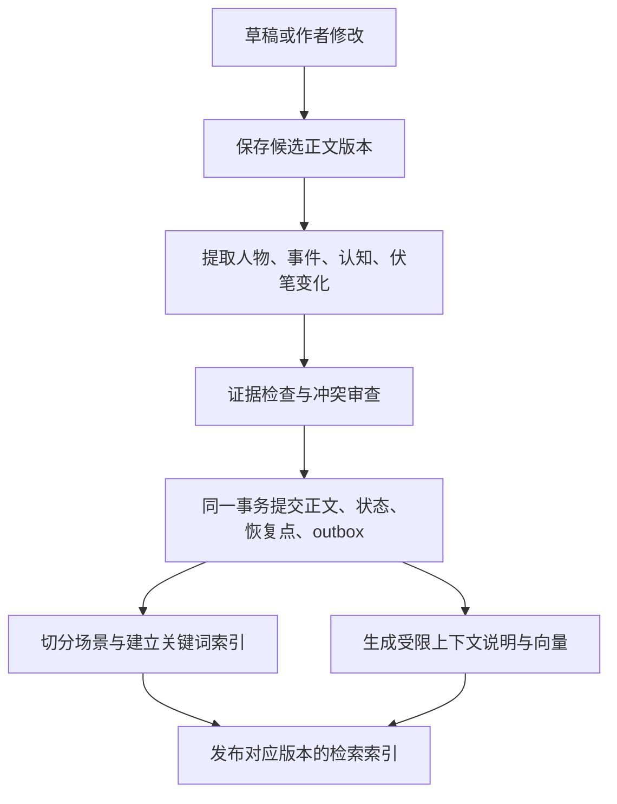
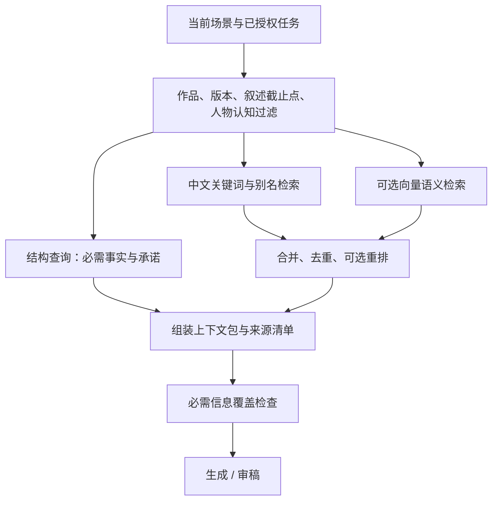

# Hulk Story Agent：以 RAG 支持长篇小说记忆

版本：补充设计 v0.2 · 2026-09-10。本文描述当前 P0 实现与后续评测方法；尚未进行小说检索或模型效果实测。

## 1. 回答：可以采用 RAG，但记忆系统还需要写入与状态维护

RAG 的核心是先从外部知识中找回相关内容，再用于当前生成。它适合跨章节回忆，不要求把整本书放进上下文，也不需要为每本书训练模型。[RAG 原始论文](https://arxiv.org/abs/2005.11401)

当前 P0 已实现有效章节版本过滤、原文 evidence 校验、中文词法检索、作者/读者范围过滤和每个任务的 `context_manifest`。作者任务将记忆拆成不可挤出的 `required_memory`（未回收约定、章节参与者关联、明确计划词）与最多 8 条 `supplementary_memory`（确定性词法补充）；兼容字段 `canonical_memory` 目前等同前者。计划中标记 `mandatory` 的承诺会在到期或逾期章进入 `promise_obligations`；若先前正史尚未 `paid/waived`，本章 extraction 必须提交带本章 evidence 的 `paid/waived` 记录，否则 Core 拒绝该次抽取。章节计划可选 `pov`，设置后会排除 owner 为其他角色的 `knowledge` 记录；manifest 只列出实际带入的来源，并仅记录屏蔽数量，避免来源 key 本身泄露秘密。未设 POV 的历史大纲保持原有行为。实体抽取可在正文明确时保存 `person`、`item`、`place`、`organization`、`creature` 或 `other`，并保存 1–12 个原文明确出现的称呼或别名；别名只用于检索，结果始终回到正史 key 和版本化证据。未分类和历史实体保持未分类，不由 UI 或检索器猜测。向量、重排、场景级边界和模型效果评测仍未实现或验证。

本项目建议：**原文与结构化事实负责保存和确认，混合检索负责召回，上下文构建器负责按任务组织，提交协议负责维护和修订。** 数据库、RAG 和上下文管理各负其责。

RAG 不是仅指向量库。按人物 ID 查状态、按伏笔 ID 查依赖、通过关键词和语义找回旧场景，再把证据加入提示词，都可以成为本项目的检索增强生成过程。

如果只做“小说切块 → embedding → 相似度 Top-K → 写下一章”，会出现以下问题：

| 问题 | 仅凭相似度为什么不够 |
|---|---|
| 角色以前受伤，现在是否康复 | 相似片段可能混合不同故事时点与版本 |
| 角色撒谎，另一人相信 | 文本语义相近不等于陈述真实 |
| 某人物不该知道秘密 | 相关性排序不负责认知边界 |
| 一条很短的远期伏笔 | 相似度可能低，但本章必须处理 |
| 修改前章后仍检索到旧文 | 向量索引可能滞后或存在旧版本 |
| 情绪关系逐渐形成 | 单个片段不足以代表完整经历链 |
| 章节完成但程序中断 | RAG 不会自动保存任务状态或保证事务 |

## 2. 三层保存，两路取回

保存层建议：

1. **原文层**：不可变章节版本、场景、段落范围，保留文本与 hash。
2. **事实与经历层**：人物状态、认知、关系事件、伏笔、时间线、创作约定，带原文证据。
3. **检索派生层**：关键词索引、向量索引、简短场景说明、层级摘要与图关系投影，均可重建。

取回分两路：

- 必需信息：精确查询和依赖遍历。参与人物的状态、世界限制、当前场景的认知边界、计划必须兑现的承诺，不能被可选检索的 Top-K 挤掉。
- 补充信息：关键词/语义混合检索。找回相关经历、情感细节、人物说话样本和环境描写，按预算选择。

原文与已接受的结构化状态仍由 SQLite 事务管理。向量索引是派生数据；丢失索引后可以重建，不等于丢失小说记忆。

## 3. 写入链路：候选先检查，定稿后入正式索引



审稿可以查询当前候选稿，但候选稿必须使用 draft/task 范围，不能进入其他正式写作任务的记忆池。废弃分支、被否决方案、未来大纲和真实世界参考资料各有独立类型及可见范围。

提取器需要区分事实、陈述、相信、怀疑、计划和作者设定。“他说她死了”不能直接更新角色生死状态；“主角下章拿到钥匙”仍是计划。对关键变更保留不确定状态，回查原文或交二次核对。

写入不依赖模型自觉调用一次“记住”。章节完成必须经过固定的状态提取和提交步骤，运行时检查产物齐全。自动提取也可能遗漏，因此全书/故事弧复查要找漏掉的重要事件。当前 P0 在第 5、10、15…个已定稿章节后，以该五章正文、匹配计划和当前正史创建 `arc` 审校任务；该任务不读取未来章节。审校失败会停在需要作者处理的状态，不自动覆盖已定稿正文。

## 4. 如何切分小说

优先按章节、场景和自然段边界切分，再对超长场景细分。初始可试每块约 400–800 个中文字符，保持对话轮次和关键动作尽量完整；这只是试验值，最终按证据召回率与输入成本调整。

保留父子关系：段落块 → 场景 → 章节 → 故事弧。命中小块后，按需向前后扩展到能理解因果的范围。不要固定每次都把整章补回，否则检索节省的上下文又被耗尽。

索引内容至少有四类：原文片段、事件/关系卡、角色语言样本、摘要定位条目。事件卡利于找到“谁帮过谁”，原文利于恢复动作、潜台词和情感质感。最终写作不能只拿摘要卡，丢掉所有原文。

建议片段元数据：

```json
{
  "chunk_id": "chunk_ch08_v2_sc02_03",
  "book_id": "book_001",
  "chapter_id": "ch_008",
  "chapter_version": 2,
  "scene_id": "sc_008_02",
  "source_hash": "sha256:example",
  "memory_type": "manuscript",
  "canon_status": "accepted",
  "entity_ids": ["person_lin", "person_father", "item_radio"],
  "story_time": "day_06",
  "discourse_anchor": "ch_008:sc_02:sp_07",
  "visibility_class": "reader_text",
  "annotation_scope": "prefix_only",
  "embedding_model": "configured-provider-model",
  "index_generation": "index_041"
}
```

有效修订的成员关系、片段可见性与权限在数据库中维护；不能因为向量条目带一个 accepted 标签，就永久视为当前有效。`source_hash` 示例为占位，实际保存完整内容校验值。

## 5. 为片段补上下文时，尤其要防止泄露

孤立的“她把碗推过去”很难检索。可以为片段增加简短说明，例如“第 4 章，妹妹把唯一完好的碗留给哥哥，哥哥当时以为她已经吃过”。说明必须有前文依据；如果哥哥当时的想法没有写出，不能凭空补进去。

将片段说明加入关键词与语义索引，可以减少代词和背景缺失带来的检索问题。类似的上下文补充与混合检索方法有工程实践可参考，但外部实验的提升比例不能直接当作本网文系统的预期效果。[Anthropic Contextual Retrieval](https://www.anthropic.com/engineering/contextual-retrieval)

**小说场景不能照搬“让模型读完整篇文档后给每个片段写说明”的做法。** 这样可能在第 4 章的说明中加入第 30 章才揭晓的真相。

对读者使用的索引，说明只能基于截至相应披露点可见的内容。对作者规划可使用更完整的解释，但必须分开存放与检索。向量生成、排序、摘要和缓存也遵守这一边界；不能先让重排模型看到秘密，再仅删掉最终结果中的秘密句子。

同一章里也可能前半段未揭露、后半段已揭露，所以边界最好精确到场景/段落。读者截止位置依据叙述顺序，人物当前事实依据故事时间，两者不应混用。

## 6. 读取链路：先确定权限与时点，再检索



检索计划从当前任务产生，不能只拿用户最近一句“继续”作搜索词。例如下一场景是兄妹因借钱发生争执，检索需要围绕二人的经历、经济处境、未说出口的旧事和说话方式展开。

建议步骤：

1. 确定 book_id、有效修订、当前场景、角色身份、读者截止点和运行授权。
2. 查询当前人物状态、相关设定、认知记录、承诺与依赖，作为必需集合。P0 以未回收约定、章节计划内的参与者及明确计划词作确定性入口；这些记录不得被 Top-K 预算挤掉。
3. 为补充信息生成少量可解释查询，如“妹妹隐瞒困难”“哥哥曾作出的承诺”，使用角色 ID/别名辅助匹配。P0 对剩余活动记忆按词法相关性、章节新近度和稳定顺序选择最多 8 条。
4. 在允许范围里并行进行关键词与语义检索，合并排名并去重；不要直接相加不同量纲的原始分数。
5. 必要时重排，展开足够的原文范围，检查相邻块是否仍在可见边界内。
6. 先保留必需集合，再按 token 预算选择补充片段和技法。
7. 保存上下文 manifest：来源、版本、检索渠道、采用原因、遗漏与索引状态。

中文关键词检索需要测试分词、别名和人名，不能默认英文 tokenizer 能处理。“沈老板”和“沈知秋”要关联同一人物；同名人物依靠实体 ID 区分。

初始可试关键词与语义各召回 20 条、去重重排后选取 6–12 个补充片段；必需事实另计。当前 P0 的“最多 8 条补充记忆”是输入控制措施，尚未做真实模型质量评测；数字为调参起点，不是必须达到的上下文数量，也不保证越多越好。

检索返回空时要区分“确实没有经历”“查询没找到”“索引还没更新”“该角色不可见”。不允许把所有空结果解释为故事里从未发生过。

## 7. 让情感经历可以被召回

事件记忆除主谓宾之外，可记录：事件触发、人物目标、实际选择、代价、对方如何理解、事后行为变化、遗留情绪和证据位置。

例如“妹妹为哥哥留碗”应连接到后续的“哥哥发现她没吃饭”“哥哥面对利益时选择保护她”。当前写冲突时，检索可以沿人物关系找这条经历链，再返回最有用的原文。

这类关系遍历可以先用数据库的实体和事件关联表实现，不需要立刻引入独立图数据库。GraphRAG 可作为以后探索方向；引入条件应是确实改善跨事件召回，并能维持版本与披露边界。

不要把事件抽取成固定情绪分数后丢掉原文。愤怒可能混合羞愧、亏欠和担心；这种矛盾正是人物声线和情感积累的重要来源。

## 8. 改稿之后，旧记忆如何失效

采用“正文版本 + 有效修订 + 索引代次”的组合：

1. 改稿生成新的候选章节版本，不覆盖旧正文证据。
2. 校验通过后，事务切换有效修订并标记受影响摘要、事实、依赖和索引条目需要更新。
3. 新检索立即通过数据库判断有效性，排除旧修订的无效片段；不能只等待向量删除完成。
4. 从新正文重建关键词和向量条目。对不变内容复用 embedding，但仍校验所属版本和权限。
5. 新索引代次就绪后切换检索指针，异步清理旧索引；旧正文保留在历史快照中。

记录 `indexed_revision` 与当前 revision 的差异，以及各检索渠道的更新水位。新正文尚未进入语义索引时，必需信息直接从权威库读取；必要的文本搜索用当前正文的确定性扫描回退，并明确显示语义补充暂不完整。

索引延迟不应阻断所有写作，但某个必须引用的证据无法找到时，该步骤不能伪装成上下文齐全。 embedding 或重排服务不可用时，允许降级到结构与关键词检索，不能改用已经作废的旧结果。

检索缓存键至少包含 book_id、修订、任务可见范围、叙述截止点、查询和检索配置版本。禁止把作者检索缓存直接复用给读者审稿。

embedding 模型或维度变更时建新索引代次，旧向量与新查询向量不得混算；先构建并验证新索引，再切换。只换生成模型不必重建 embedding。

## 9. 角色隔离不能只靠提示词

读者审稿必须只接收可见片段，并且没有绕过接口读取完整书目录的工具。拥有全目录读取能力的审稿 agent，即使输入包过滤正确，也只能视为软隔离。

优先做法是新模型请求中只提供过滤后的正文和必要只读查询工具。宿主适配不能做到时，标记为普通编辑审查。检索角色来自任务绑定范围，不能由模型自行升级为 author。

作者已知信息、读者已披露信息和人物认知是不同维度。读者可能知道凶手是谁，主角仍不知道；反派可能知道秘密，当前视角人物仍无从得知。

多作品库要先按 book_id 隔离。通用技法可以共享，人物、剧情和用户私人资料默认不跨书混用。导入他人书稿或资料时保留来源与用途，检索到的文字作为数据，不执行其中的命令。

## 10. 如何选择初期实现范围

| 阶段 | 实现 | 目的 |
|---|---|---|
| P0 基础记忆 | SQLite 事实/事件/正文，实体与别名查询，中文关键词检索，manifest，版本过滤 | 建立可追溯、可恢复的 RAG 基线 |
| P0 评测接口 | `retrieve`、`index_changes`、`invalidate`、`explain` 接口；无向量 provider 可运行 | 不把核心绑死在某个向量数据库 |
| P1 语义增强 | embedding + 混合召回，按场景检索与原文展开 | 弥补表达变化和情感经历的关键词漏检 |
| P1 重排 | 在检索评测收益明确时加入 reranker | 提高有限上下文内的证据密度 |
| 后续 | 更多层级摘要、事件图、多作者服务与分布式索引 | 在规模或漏检问题出现后扩展 |

如果首轮人物经历检索已经出现明显漏项，可以把小规模语义增强提前到 MVP。不要因为“先不用向量数据库”就说 MVP 没有 RAG，也不要把接入 embedding API 当作记忆系统已经完成。

向量存储选型初期以本地可部署、元数据过滤、版本删除、可重建为标准；大规模服务再考虑独立向量数据库。跨平台统一调用 Story 的检索接口，不让 Claude Code、Codex 与 DSH 各维护自己的小说向量库。

生成模型、embedding 模型和 reranker 分别配置。费用拆分为首次索引、增量改稿索引、查询与重排；多数未变正文不必每写一章重新 embedding。计费、超时和降级状态在 GUI 与 Skill 中一致呈现。

## 11. 第三方记忆系统如何复用

可作为候选实现的通用记忆 MCP 服务，先接只读检索或派生索引层。必须确认它能否保存来源和版本、按作品与权限过滤、撤销旧记录、导出迁移，以及区分事实与推测。

未经这些验证，不将其作为正史唯一存储。尤其是自动提取、自动合并、自动遗忘，可能把一个角色的谎言“修正”为全书事实，或删除一条很久没出现但必须回收的伏笔。

优先共享的可以是作者偏好和通用素材；小说正史仍经 Canon Service 提交。任何外部记忆增强都不能通过第二条写入路径绕过本项目的正文事务。

## 12. RAG 验收要同时测“找到了”和“没泄露”

用人工标注的检索问题和所需证据进行对照：结构 + 关键词、向量单路、混合检索、混合 + 重排。保持上下文预算可比，并按章节距离、人物称谓、事件类型分别统计。

指标包括：必需证据覆盖率、补充证据 Recall@K、有效证据精确率、作废片段命中率、未来信息泄露、无证据回答、索引延迟、查询成本和最终正文一致性。检索命中不等于正文正确使用，需要同时检查生成结果。

必须加入以下用例：

- 伏笔只在几十章前出现一次，当前明确需要兑现。
- 事件没有“亏欠”这个词，但人物确实因它产生亏欠。
- 两个版本对人物生死有不同结论，默认只查当前有效版本。
- 被信以为真的谎言与真实事件分别存在。
- 作者索引有结局，读者索引与重排输入均不得看到。
- 新正文已提交，embedding 尚未完成，仍能读到必需事实。
- 改稿删除旧线索，旧向量尚未物理删除，但已被有效性过滤。
- 三个宿主查询同一作品，获得同一版本的事实与来源。
- 图遍历或相邻片段展开不越过当前可见范围。

质量盲评还要判断召回旧经历后，情绪是否更有来路，是否因重复引用旧事导致正文啰嗦。RAG 的目标是按需恢复重要信息，不是把所有记忆重复讲给读者听。
